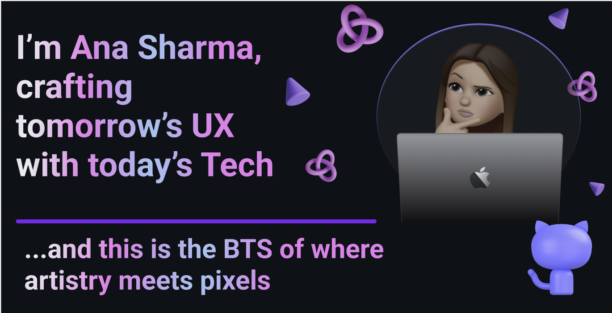

<h3 align="center">A passionate front-end wizard and UX/UI alchemist</h3>

    

<!-- Add some space between the first and second image -->
  
  

<!-- Removed the trophy section -->
<!-- Adjusted spacing before and after the banner -->
 

  

- 🌱 I’m currently learning **React, JSON, REST APIs**

- 👯 I’m looking to collaborate on **ML/AI/NLP projects**

- 💬 Ask me about **Figma prototyping, wire framing, user experience**

- 📫 How to reach me **aanasharma15@gmail.com**

- ⚡ Fun fact **UX/UI designer by day, painter, musician, equestrian, and perfume connoisseur by heart - where art meets technology, that's where you'll find me.**

<h3 align="left">Connect with me:</h3>

<!-- Spacing between sections -->
 

<h3 align="left">Languages and Tools:</h3>

<!-- Icons... -->

&nbsp;

