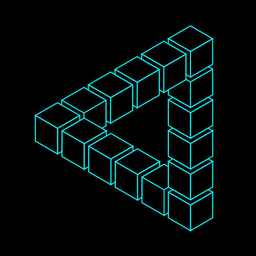
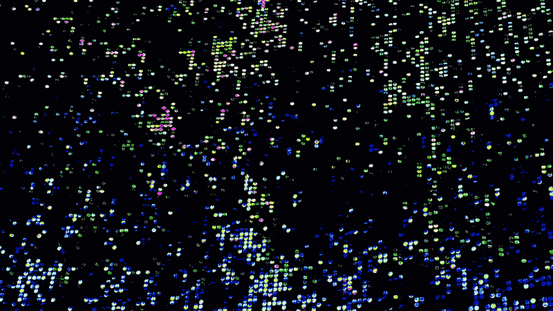

  
   
  
   
   
  <b>Engineer & Implementer</b> 
  <i>Shipping secure, high-velocity AI & Product infrastructure.</i>
   
   
  
  
  
  
   
  
  
  
   
  
  
  

---

### ⬡ Current Focus
I build and ship production-ready systems that integrate automated AI pipelines with growth-driven infrastructure.

- **AI Operations:** Engineering automated AEO/SEO pipelines and LLM-integrated workflows.
- **Product Implementation:** Shipping high-fidelity, experiment-ready interfaces and reporting systems.
- **Applied Security:** Implementing automated QA, secure data privacy protocols, and network analysis.

---

### ◈ Core Stack
- **Development:** Python (FastAPI/Flask), JavaScript (React/Next.js), Swift, Java, SQL
- **Systems & Security:** Network Traffic Analysis, IoMT Security, Digital Forensics, Linux
- **Visual Engineering:** Figma, Procreate, HCI Principles, System Visualization

---

  
   
   
  

---

### 🔗 Connectivity
[LinkedIn](https://www.linkedin.com/in/anasharma15/) | [Email](mailto:aanasharma15@gmail.com)
