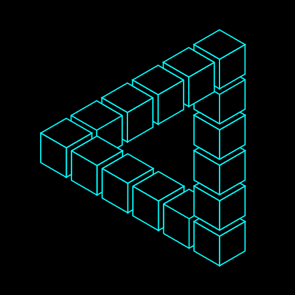
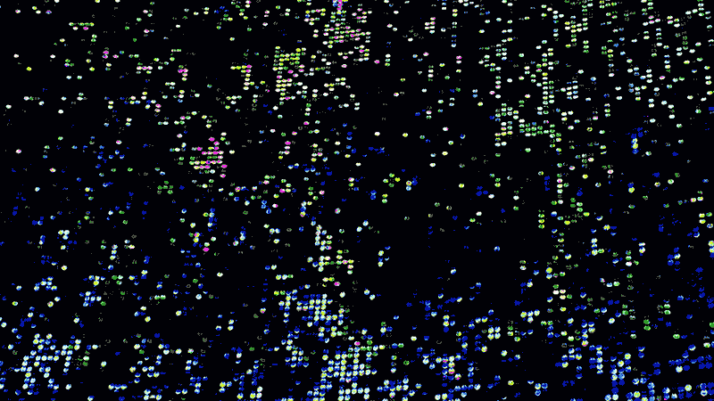

  
   
  
   
   
  <b>Cybersecurity × AI × Human-Centered Technology</b> 
  <i>I want to know what's underneath the interface.</i>
   
   
  
  
  
  
   
  
  
  
   
  
  
  

---

### ⬡ Interest
How applications work.
How AI systems interact with them.
How data moves through systems.
How people behave inside technology.
And how we make those systems harder to break.

---

**◇ Current Stack**
Languages                          Python · JavaScript · Java · C++ · Swift · SQL

Applications                       React · Next.js · Django · FastAPI

AI                                 LangChain · LangGraph · n8n · NLP · ML

Security                           Fortinet · Wireshark · Burp Suite · Nessus
                                   Metasploit · Splunk · Suricata · Autopsy

Infrastructure                     AWS · GCP · Docker · Kubernetes · Terraform

Data                               PostgreSQL · MySQL · MongoDB · SQL Server

Design                             Figma · HCI · Data Visualization · D3

---

  
   
   
  

---

### 🔗 Connectivity
[LinkedIn](https://www.linkedin.com/in/anasharma15/) | [Email](mailto:aanasharma15@gmail.com)

